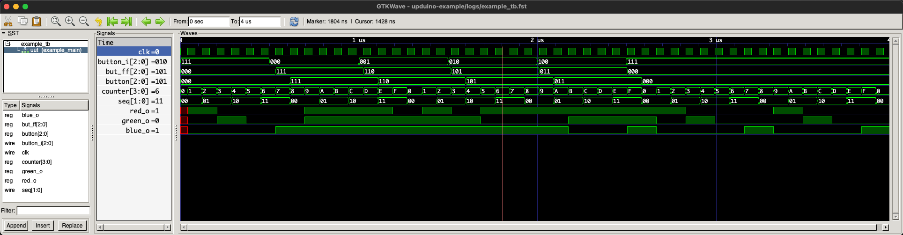

# UPduino Example Project for SystemVerilog

## Using Makefile and Open Source Tools

This project tries to provide a "starting project design" for the UPduino FPGA
board using open source tools using a (hopefully) robust Makefile and a small
example and useful info to help you get started to making your own designs.
Mostly a "fancy blinky" project.

This example is MIT-0 licensed.  This means you are free to do as you wish with
it, including putting your name on it and applying a different license - you are
encouraged to make it into _your_ project.

There are a few areas where this may be helpful to get you started.  First, the
Makefile is setup for:

* Verilator lint and warning checking (for improved error messages and to help
  avoid common mistakes and pitfalls)
* Icarus Verilog simulation (which is critical to allow you to test and debug
  your design)
* Yosys SystemVerilog FPGA synthesis setup (so your design can run on UPduino FPGA)

This setup was also designed to be fairly easy to get up and running on multiple
operating systems (Linux, macOS and Windows using WSL2) with a minimum of hassle
and dependencies:

NOTE: While the tools themselves _can_ run native on Windows (typically with
MSYS2), that tends to make things difficult for a portable project like this due
to (mostly) shell and path issues so I leave that as an "exercise for the
reader" (and WSL2 works fairly well).

In addition to this, the example design serves as an example of how to use a
few basic useful features of the UPduino and iCE40UltraPlus5K FPGA:

* Clock generation options:
    * High-frequency ~48 MHz on-chip oscillator (with divide by 1/2/4/8 pre-scaler)
    * External clock input source (12 MHz from 12M pin via wire or OSC jumper)
* GPIO pin options (e.g., to enable handy internal pull-up resistor on a pin)

This Makefile also handles most of the typically needed options and is fairly
well commented to help you understand the build and synthesis process (and tweak
it for your project).

In addition, the dependencies needed for this project should be just `make`
(typically installed by default or a `build-essential` or similar package) and
the open source FPGA tools that are all the ones this project needs are
conveniently built and packaged up nightly for common operating systems here
[YosysHQ oss-cad-suite](https://github.com/YosysHQ/oss-cad-suite-build).  Go to
[releases](https://github.com/YosysHQ/oss-cad-suite-build/releases/latest),
download the package for your computer, extract it and either add its `bin` to
your `PATH` (I recommend at the very beginning to avoid issues) or "`source`
_<extracted_location>_`/oss-cad-suite/environment`" (which will do that along
with a bit of additional setup).  You can also build the needed packages from
source, or perhaps your distribution has them available as a (recent enough)
package.

See [INSTALLATION.md](INSTALLATION.md) for details on installing the
dependencies needed for this project.

See [BUILDING.md](BUILDING.md) for details on building this project.

### A Note About SystemVerilog versus Verilog

If you are wondering why this project is using SystemVerilog instead of
"regular" Verilog, understand that SystemVerilog is just the latest version of
Verilog (and given a new name since it got "fancy").  It is designed to be
entirely backwards compatible with Verilog.  While SystemVerilog has added a
_huge_ number of things to "regular" Verilog, most can be ignored for the
purposes of FPGA synthesis (most of it is for complex simulation and
verification).  The open source tools support only a subset of SystemVerilog but
this is enough for some "quality of life" improvements and can make some things
less error prone and confusing.

The main additional SystemVerilog features used in this design are:

* Using `.sv` for the file extension (largely for potentially improved syntax
  highlighting)
* Using `logic` instead of choosing between `reg` or `wire` (except on input
  ports, which use `logic wire`)
* Using `always_ff` for synchronous blocks (those with clocked logic)
* Using `always_comb` for combinatorial blocks (logic without a clock)
* Allow use of `'0` to mean any number of zero bits (as wide as the destination)
* Allows use of `enum` and `typedef` for enumerations and more expressive and
  readable types
* Allows use of SystemVerilog `package` to group common design parameters
  together (along with package namespace prefix e.g. `package::member` and `import`)

This design also attempts to follow the "best practices" outlined in the
excellent book
[RTL Modelling with SystemVerilog for Simulation and Synthesis](https://www.amazon.com/RTL-Modeling-SystemVerilog-Simulation-Synthesis/dp/1546776346).
In addition this
[Verilog Style Guide](https://github.com/lowRISC/style-guides/blob/master/VerilogCodingStyle.md)
may be helpful.

### A Note About Text Editors

You are of course free to use whatever text editor you are most comfortable
with.  Many have syntax highlighting and other features specifically for
SystemVerilog (or Verilog) you may find helpful.

It is also worth mentioning that if you use
[Visual Studio Code](https://code.visualstudio.com/) (a freely available editor
from Microsoft for Windows, Linux and macOS), there are several nice
SystemVerilog (and Verilog) extensions available.  Some will even run Verilator
(or other utility) in the background and do on the fly "lint" checking with
error and warning "squiggles".  This can be extremely helpful when learning
(reducing the frustration from repeatedly having to save, run `make` and re-read
diagnostic messages over and over as you iterate working to fix issues).
